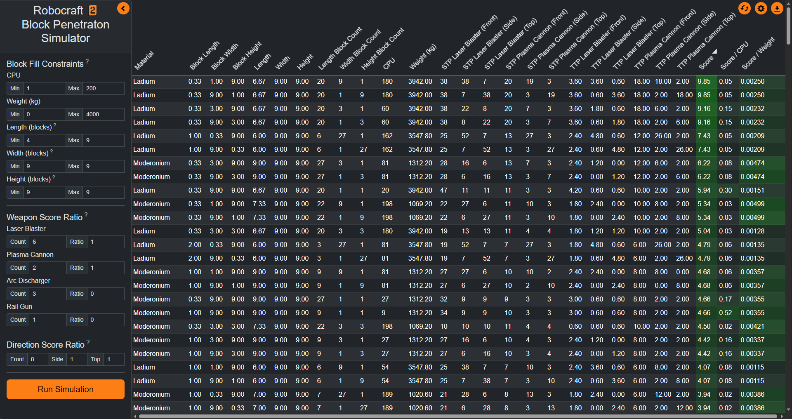
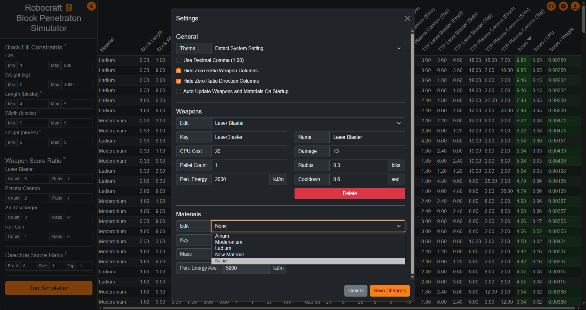

# Robocraft 2 Block Penetration Simulator
This application reverse engineers the damage mechanics of the game Robocraft 2, in order to simulate and rank in-game armor of various shapes, weights, and costs against a custom weighting of various weapon's damage from multiple directions.

## Features
Set up simulation constraints for shape, weight, and cost of block armor, then set weights for weapons and directions of incomming damage. Finally run the simulation and sort / filter the results to find the best fitting armor for your Robocraft.

Customize the theme and visualization to your liking, and edit material or weapon stats to test upcomming changes.

## Tech Stack
- Languages: C#, JavaScript, HTML, CSS
- Frameworks: Blazor, WPF, Bootstrap
